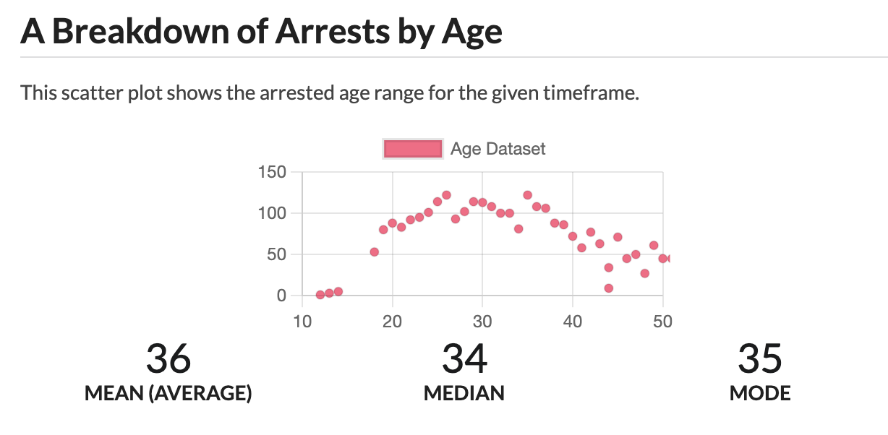

  👮📊

  <h3 align="center">HPD Stats</h3>

  

    A project to track the statistics of the arrests of the <a href="https://www.honolulupd.org/">Honolulu Police Department</a>
     
    <a href="https://hpdstats.com">View Project</a>

<!-- ABOUT THE PROJECT -->
## About The Project

This project provides a dashboard interface that tracks and updates from the [HPD's published daily arrest log reports](https://www.honolulupd.org/information/arrest-logs/).

### Why this exists:
The Attorney General's Office provides [annual reports](https://ag.hawaii.gov/cpja/rs/cih/) as to the state of crime in Hawaii. This project provides a mechanism to validate these reports, track the numbers daily, and keep an archive of the raw data.

### Project Screenshots

#### Arrests by Sex

#### Arrests by Age

#### Arrests by Ethnicity

#### Officer Breakdown

## How It Works

Using a combination of image cropping and OCR, we extract data about each arrest from each daily published arrest log.

### Full Breakdown

Everyday (with `cron`!), the script is run (`cd scrape && python3 main.py`) to scrape and parse the newly published arrest log. It then does the following:

1. Uploads the PDF file to AWS S3 [for archiving](https://hpdstats.com/archive)
2. Downloads the PDF file locally for parsing purposes

After we download the file, we prepare it for image cropping and OCR. To do this, we

1. Split the PDF into individual pages ([Example Page PDF](docs/example_page.pdf))
2. Convert all the PDF file's pages into images ([Example Page Image](docs/example_page.png))
3. Vertically concat all the page images into one long image, cropping the top and the bottom out so we only contain arrest records ([Example Vertically Concatted Image](docs/example_vconcat.png))
4. Crop each individual arrest record using the location of pixels ([Example Record Image](docs/example_record.png))
5. Crop each portion of the arrest record by the categories we want to parse:
  - [Example Record - Age Category](docs/example_record_age.png)
  - [Example Record - Ethnicities Category](docs/example_record_ethnicities.png)
6. Use OCR([PyTesseract](https://pypi.org/project/pytesseract/)) to parse the text

We then upload the data to AWS DynamoDB. Using Flask and DynamoDB's boto3 module, data is served to the [HPDStats website](https://hpdstats.com/). An example of the artifacts generated from the script can be viewed here: [Example Artifacts](https://honolulupd-artifacts.s3.us-west-1.amazonaws.com/2022-01-01.zip)